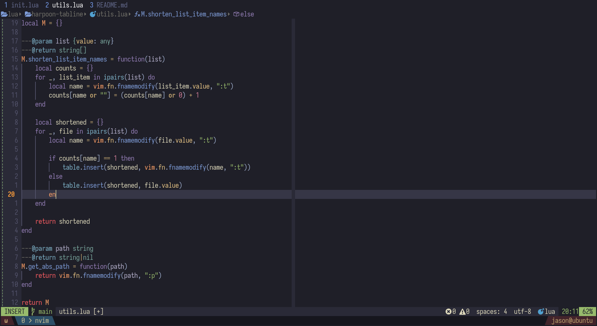

# harpoon-tabline.nvim

Extension for [Harpoon 2](https://github.com/ThePrimeagen/harpoon/tree/harpoon2)
that displays harpoon marks in your tabline.

This was a feature in the original version of harpoon, but was removed in
Harpoon 2.



## Setup

Simply call setup after harpoon:

```lua
  require('harpoon'):setup()
  -- ...
  require('harpoon-tabline').setup()
```

## Configuration

By default, harpoon-tabline comes with these defaults:

```lua
---@class Config
---@field tab_prefix? string
---@field tab_suffix? string
---@field use_editor_color_scheme? boolean
---@field format_item_names? (fun(list: {value: any}): string[])
local config = {
    tab_prefix = " ",
    tab_suffix = " ",
    use_editor_color_scheme = true,
    format_item_names = utils.shorten_list_item_names,
}
```

- `tab_prefix`/`tab_suffix`: Defines the prefix/suffix for each tab in your tabline.
- `use_editor_color_scheme`: Enables/disables setting the highlight groups for
  the tabline to the default `Tabline`/`TablineSel` highlight groups that your
  color scheme defines.
- `format_item_names`: A function that takes in the list of harpoon marks/list
  items, and returns a string array that will be used as the content for the
  tabline. By default, this shortens the filepaths to the filename, unless there
  are two matching file names. If there are two matching file names, the file
  path will be used instead.

### Setting custom highlight colors

Within setup, assure `use_editor_color_scheme` is set to false:

```lua
require('harpoon-tabline').setup({
    use_editor_color_scheme = false,
})
```

then, manually set the following highlight groups:

- HarpoonActive
- HarpoonInactive
- HarpoonNumberActive
- HarpoonNumberInactive

example colors, with TabLineFill also set:

```lua
vim.api.nvim_set_hl(0, 'HarpoonActive', { foreground = 'white', background = 'NONE' })
vim.api.nvim_set_hl(0, 'HarpoonInactive', { foreground = '#63698c', background = 'NONE' })
vim.api.nvim_set_hl(0, 'HarpoonNumberActive', { foreground = '#7aa2f7', background = 'NONE' })
vim.api.nvim_set_hl(0, 'HarpoonNumberInactive', { foreground = '#7aa2f7', background = 'NONE' })
vim.api.nvim_set_hl(0, 'TabLineFill', { foreground = 'white', background = 'NONE' })
```

If you would like some of the highlight groups to use your color scheme's
defaults, you can link the groups to them like so:

```lua
-- defaults used within the plugin when use_editor_color_scheme = true:
vim.api.nvim_set_hl(0, "HarpoonActive", { link = "TabLineSel" })
vim.api.nvim_set_hl(0, "HarpoonInactive", { link = "TabLine" })
vim.api.nvim_set_hl(0, "HarpoonNumberActive", { link = "TabLineSel" })
vim.api.nvim_set_hl(0, "HarpoonNumberInactive", { link = "TabLine" })
```

## Known Issues

- I am not sure if this plugin will work if you extend harpoon mark more than
  files, such as marking terminal/tmux sessions. This is outside of my use case,
  however you are welcome to open a PR to add this functionality.
